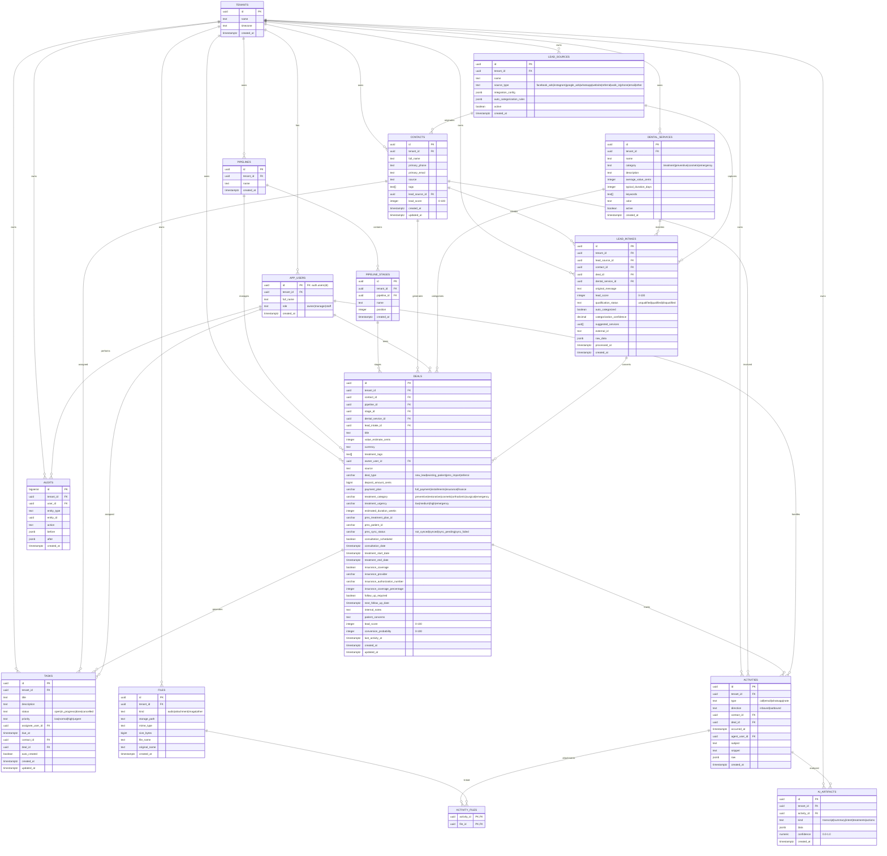

# 🏗️ **DentalCRM Database Architecture**

## 📊 **Entity Relationship Diagram**

## 🎯 **Key Architecture Features**

### 🏢 **Multi-Tenancy**
- **Tenant Isolation**: Every table includes `tenant_id` for complete data separation
- **Scalable**: Supports multiple dental practices on single database
- **Secure**: Row-level security (RLS) ready for production

### 📞 **Contact & Deal Management**
- **360° Contact View**: Links contacts to deals, tasks, and activities
- **Pipeline Management**: Flexible stage-based deal progression
- **Enhanced Deal Tracking**: Treatment categories, PMS integration, insurance handling

### 🤖 **AI-Powered Insights**
- **Audio Processing**: Stores audio files with automatic transcription
- **Comprehensive Analysis**: AI artifacts for transcript, summary, treatments, actions
- **Smart Task Generation**: Auto-creates follow-up tasks from call analysis

### 📊 **Lead Management System**
- **Multi-Source Capture**: Facebook, Instagram, Google Ads, WhatsApp, website
- **Auto-Categorization**: AI-powered service matching based on keywords
- **Lead Scoring**: 0-100 scoring system for qualification
- **Conversion Tracking**: Full funnel from lead intake to deal closure

### 📁 **File Management**
- **Flexible Storage**: Audio, attachments, images with metadata
- **Activity Linking**: Files attached to specific activities
- **Supabase Storage**: Secure cloud storage with signed URLs

### 📈 **Analytics & Reporting**
- **Lead Pipeline Analytics**: Built-in view for conversion tracking
- **Performance Metrics**: Lead scores, conversion rates, pipeline values
- **Audit Trail**: Complete change tracking for compliance

## 🔧 **Technical Specifications**

### **Database Engine**: PostgreSQL (Supabase)
### **Key Extensions**: 
- `uuid-ossp` for UUID generation
- JSONB for flexible data storage
- Full-text search capabilities

### **Performance Optimizations**:
- Strategic indexes on high-query columns
- Optimized for tenant-based queries
- Efficient relationship traversal

### **Data Types**:
- **UUIDs**: Primary keys and foreign keys
- **JSONB**: Flexible metadata and configuration storage
- **Arrays**: Tags, keywords, suggested services
- **Timestamps**: Full timezone support
- **Constraints**: Data integrity and validation

This architecture supports a production-ready dental CRM with sophisticated lead management, AI-powered call analysis, and comprehensive patient/deal tracking! 🦷✨

