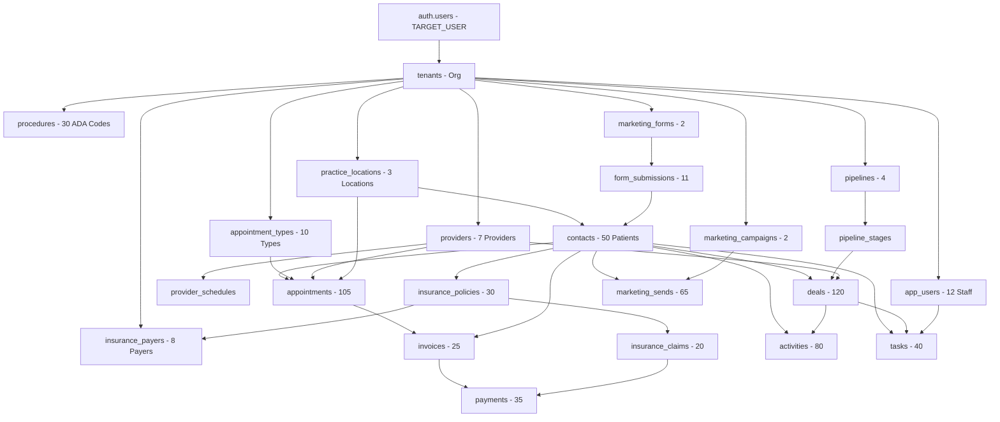

# 🎯 DEMO DATASET PLAN - "deepak_demo_pack_v1"

**Repository**: AgenttoffeeOrg/dental-crm-private  
**Target User**: `TARGET_USER_EMAIL` (from environment variable)  
**Seed Pack ID**: `deepak_demo_pack_v1`  
**Created**: October 18, 2025  
**Status**: ⏸️ AWAITING APPROVAL

---

## ⚠️ NON-NEGOTIABLE SAFETY REQUIREMENTS

### ✅ Security
- [ ] NO hardcoded passwords or secrets - Use GitHub Actions secrets/variables only
- [ ] NO modification of global behavior or other tenants
- [ ] Operate ONLY within target user's organization
- [ ] All emails use non-routable domains (`@example.com`)
- [ ] All phone numbers use safe test ranges (`+1-555-*`)
- [ ] NO real external API calls (emails/SMS/WhatsApp are simulated logs)

### ✅ Reversibility
- [ ] ALL data tagged with `seed_pack_id = "deepak_demo_pack_v1"`
- [ ] Full idempotency - can re-run safely
- [ ] Complete rollback via `npm run clear:deepak`
- [ ] Restore to clean state after deletion

### ✅ Configuration
- [ ] `TARGET_USER_EMAIL` - GitHub repo variable (required)
- [ ] `TARGET_USER_TEMP_PASSWORD` - GitHub secret (optional, for local auth)
- [ ] `SEED_PACK_ID` - GitHub repo variable = `"deepak_demo_pack_v1"`

---

## 📊 DISCOVERED STACK

### Database
- **Platform**: Supabase (PostgreSQL 15+)
- **ORM**: None - Direct SQL
- **Auth**: Supabase Auth (`auth.users`)
- **Storage**: Supabase Storage (for file attachments)

### Core Architecture
- **Multi-Tenant**: All tables have `tenant_id` FK to `tenants(id)`
- **Row-Level Security**: RLS policies enforce tenant isolation
- **UUID Primary Keys**: All entities use `uuid_generate_v4()`
- **Soft Deletes**: Via `ON DELETE CASCADE` constraints

---

## 🗄️ EXISTING TABLES (55+ tables discovered)

### Core CRM Tables
1. `tenants` - Organizations/practices
2. `app_users` - Staff/providers (linked to `auth.users`)
3. `contacts` - Patients/leads (with comprehensive medical/insurance fields)
4. `pipelines` - Sales pipelines
5. `pipeline_stages` - Pipeline stages
6. `deals` - Opportunities/treatment plans
7. `tasks` - To-dos and follow-ups
8. `activities` - Call logs, notes, emails
9. `files` - File attachments

### Marketing Tables (20+ tables)
10. `marketing_campaigns` - Email/SMS campaigns
11. `marketing_sends` - Individual send logs
12. `marketing_events` - Opens, clicks, bounces
13. `marketing_forms` - Lead capture forms
14. `marketing_form_submissions` - Form submissions
15. `marketing_templates` - Email/SMS templates
16. `marketing_journeys` - Automation workflows
17. `marketing_segments` - Contact filters
18. `marketing_audiences` - Contact groups
19. `marketing_landing_pages` - Landing pages
20. `marketing_unsubscribes` - Unsubscribe log
21. `marketing_suppression_list` - Bounce/complaint suppression

### PMS Integration Tables
22. `pms_integrations` - PMS connections
23. `pms_patient_mappings` - Patient sync mappings
24. `treatment_plans` - Treatment plans from PMS
25. `treatment_payments` - Payment tracking
26. `pms_sync_logs` - Sync audit logs

### Analytics Tables
27. `analytics_dashboards` - Dashboard definitions
28. `analytics_widgets` - Widget configs
29. Various analytics views (10+)

### Enterprise Tables
30. `custom_roles` - RBAC roles
31. `role_permissions` - Permission mappings
32. `user_profiles` - User profile templates
33. `audit_trail` - Comprehensive audit log
34. `user_invitations` - Invite system
35. `lead_sources` - Lead source tracking
36. `lead_intakes` - Lead qualification
37. `dental_services` - Service catalog
38. `ai_artifacts` - AI-generated content

### Feature Flags
- Tenant-level flags in `tenants` table:
  - `marketing_enabled` (BOOLEAN)
  - `marketing_plan` (TEXT: 'none', 'starter', 'pro', 'enterprise')
  - `pms_integration_enabled` (BOOLEAN)

---

## 🚧 MISSING TABLES (To Be Created)

### Critical for Dental Practice Demo
1. **`practice_locations`** - Physical office locations
2. **`providers`** - Dentists and specialists (separate from staff)
3. **`provider_schedules`** - Provider availability
4. **`appointments`** - Scheduled appointments
5. **`appointment_types`** - Appointment templates (checkup, cleaning, etc.)
6. **`insurance_payers`** - Insurance companies
7. **`insurance_policies`** - Patient insurance policies
8. **`insurance_claims`** - Claims tracking
9. **`procedures`** - Dental procedure codes (ADA/CDT)
10. **`invoices`** - Billing invoices
11. **`payments`** - Payment records (card, cash, insurance)
12. **`inventory_items`** - (Optional) Supplies tracking

---

## 🎭 DEMO DATA SPECIFICATION

### Target Organization
- **Name**: Deepak's Dental Practice
- **Type**: Multi-location family dentistry
- **Locations**: 3 offices
- **Staff**: 1 owner (TARGET_USER), 2 admins, 3 dentists, 4 hygienists, 2 front desk
- **Patients**: 50 total (split 25/15/10 by location)
- **Time Range**: Past 60 days → Next 14 days

---

### 1. Organization & Users

#### Organization (1 record)
```
tenant_id: <auto-generated UUID>
name: "Deepak's Dental Practice"
legal_name: "Deepak's Dental Practice LLC"
timezone: "America/New_York"
currency: "USD"
phone: "+1-555-0100"
email: "${TARGET_USER_EMAIL}"
address: "123 Main Street"
city: "New York"
state: "NY"
zip: "10001"
seed_pack_id: "deepak_demo_pack_v1"
```

#### Locations (3 records)
1. **Manhattan Downtown**
   - Address: 123 Main Street, New York, NY 10001
   - Phone: +1-555-0101
   - Hours: Mon-Fri 8am-6pm, Sat 9am-2pm
   - Providers: Dr. Sarah Chen, Dr. Mike Rodriguez, 2 hygienists

2. **Brooklyn Heights**
   - Address: 456 Court Street, Brooklyn, NY 11201
   - Phone: +1-555-0102
   - Hours: Mon-Fri 9am-5pm
   - Providers: Dr. Emily Watson, 1 hygienist

3. **Queens Astoria**
   - Address: 789 Steinway St, Astoria, NY 11103
   - Phone: +1-555-0103
   - Hours: Tue-Sat 10am-7pm
   - Providers: Dr. Sarah Chen (rotation), 1 hygienist

#### Users (12 records)
1. **Owner/Admin** (TARGET_USER_EMAIL)
   - Role: owner
   - Access: All locations, all permissions

2. **Practice Manager** - manager@example.com
   - Role: manager
   - Access: All locations

3. **Office Admin** - admin@example.com
   - Role: admin
   - Access: Manhattan only

4. **Dr. Sarah Chen** - dr.chen+demo@example.com
   - Role: provider
   - Specialty: General Dentistry
   - Locations: Manhattan, Queens (rotation)

5. **Dr. Mike Rodriguez** - dr.rodriguez+demo@example.com
   - Role: provider
   - Specialty: Cosmetic Dentistry
   - Locations: Manhattan

6. **Dr. Emily Watson** - dr.watson+demo@example.com
   - Role: provider
   - Specialty: Pediatric Dentistry
   - Locations: Brooklyn

7-10. **4 Dental Hygienists** - hygienist[1-4]+demo@example.com

11-12. **2 Front Desk** - frontdesk[1-2]+demo@example.com

---

### 2. Patients/Contacts (50 total)

#### Manhattan Downtown (25 patients)
- Demographics: Mix of ages 8-72, 60% with insurance
- Source distribution: 40% referral, 30% Google, 20% Instagram, 10% walk-in
- Insurance: Mix of Delta Dental, Cigna, MetLife, Aetna, self-pay

#### Brooklyn Heights (15 patients)
- Demographics: Family-focused, ages 5-65
- Source: 50% referral, 30% website, 20% local ads
- Insurance: Similar mix, higher pediatric coverage

#### Queens Astoria (10 patients)
- Demographics: Diverse, ages 18-68
- Source: 40% Google, 30% Yelp, 30% referral
- Insurance: Mix, some international plans

#### Contact Fields (all 50)
```sql
- full_name: Realistic names
- primary_email: patient+{i}@example.com
- primary_phone: +1-555-02{location}{patient_num}
- date_of_birth: Spread across ages 5-75
- gender: Mix
- address, city, postal_code, country: NYC addresses
- medical_conditions: 30% have conditions (diabetes, hypertension, etc.)
- allergies: 15% have allergies (penicillin, latex, etc.)
- medications: Realistic for conditions
- emergency_contact_name, phone, relationship
- insurance_provider: See insurance section
- insurance_policy_number: Policy-{random}
- preferred_appointment_time: Mix of morning/afternoon/evening
- communication_preference: 50% email, 30% SMS, 20% phone
- last_dental_visit: Spread over past 2 years
- dental_anxiety_level: 60% none, 25% mild, 10% moderate, 5% high
- marketing_consent: 70% yes
- sms_consent: 60% yes
- email_consent: 90% yes
- location_id: Assigned by split [25,15,10]
- seed_pack_id: "deepak_demo_pack_v1"
```

---

### 3. Pipelines & Stages (4 pipelines)

#### Pipeline 1: New Patient Lead
- **Stages**: New Lead (20%) → Consult Scheduled (40%) → Consult Complete (70%) → Treatment Accepted (100%)

#### Pipeline 2: Treatment Plan
- **Stages**: Plan Proposed (30%) → Insurance Pre-Auth (50%) → Scheduled (80%) → In Progress (90%) → Completed (100%)

#### Pipeline 3: Cosmetic Procedures
- **Stages**: Initial Consult (25%) → Estimate Provided (50%) → Deposit Received (75%) → Treatment Underway (90%) → Completed (100%)

#### Pipeline 4: Recall & Maintenance
- **Stages**: Recall Due (10%) → Appointment Scheduled (60%) → Completed (100%)

---

### 4. Deals (120 total)

#### Distribution by Pipeline
- New Patient Lead: 35 deals (various stages)
- Treatment Plan: 50 deals (various stages)
- Cosmetic Procedures: 20 deals (high-value)
- Recall & Maintenance: 15 deals

#### Value Distribution
- $50 - $300: 40 deals (cleanings, checkups)
- $300 - $1,000: 35 deals (fillings, x-rays)
- $1,000 - $5,000: 30 deals (crowns, root canals)
- $5,000 - $15,000: 15 deals (implants, orthodontics)

#### Timestamps
- Created: Spread over past 60 days
- Consultation dates: Past 45 days to next 30 days
- Treatment dates: Past 30 days to next 60 days
- Closed dates: Past 30 days (for completed)

#### Deal Fields
```sql
- title: Descriptive (e.g., "Root Canal - John Smith")
- value_estimate_cents: See distribution above
- treatment_category: preventive, restorative, cosmetic, orthodontic, surgical
- treatment_urgency: 60% medium, 25% low, 10% high, 5% emergency
- consultation_scheduled: 70% yes
- consultation_date: Spread over timeline
- insurance_coverage: 60% yes
- insurance_provider: If applicable
- insurance_coverage_percentage: 50-80% for covered
- owner_user_id: Assigned to dentists
- location_id: Where treatment happens
- contact_id: Patient FK
- seed_pack_id: "deepak_demo_pack_v1"
```

---

### 5. Providers & Schedules (3 dentists, 4 hygienists)

#### Dr. Sarah Chen (Provider 1)
- **Specialty**: General Dentistry
- **Locations**: Manhattan (Mon/Wed/Fri), Queens (Tue/Thu)
- **Hours**: 8:00 AM - 5:00 PM
- **Appointment Slot Duration**: 30 min
- **Procedures**: Checkups, cleanings, fillings, root canals, crowns

#### Dr. Mike Rodriguez (Provider 2)
- **Specialty**: Cosmetic Dentistry
- **Locations**: Manhattan only
- **Hours**: 10:00 AM - 6:00 PM
- **Appointment Slot Duration**: 45 min
- **Procedures**: Veneers, whitening, bonding, crowns

#### Dr. Emily Watson (Provider 3)
- **Specialty**: Pediatric Dentistry
- **Locations**: Brooklyn only
- **Hours**: 9:00 AM - 5:00 PM
- **Appointment Slot Duration**: 30 min
- **Procedures**: Pediatric exams, sealants, fluoride, fillings

#### Hygienists (4 total)
- **Procedures**: Cleanings, x-rays, fluoride, sealants
- **Duration**: 45-60 min slots
- **Distribution**: 2 Manhattan, 1 Brooklyn, 1 Queens

---

### 6. Appointment Types (10 templates)

1. **Routine Checkup** - 30 min, $150, frequency: 6 months
2. **Cleaning (Adult)** - 60 min, $200, frequency: 6 months
3. **Cleaning (Child)** - 45 min, $120, frequency: 6 months
4. **New Patient Exam** - 60 min, $250, includes x-rays
5. **Emergency Visit** - 30 min, $300, same-day priority
6. **Filling** - 60 min, $300-$500
7. **Root Canal** - 90 min, $1,200-$1,800
8. **Crown Prep** - 90 min, $1,500-$2,500
9. **Whitening** - 60 min, $600
10. **Orthodontic Consult** - 45 min, $0 (complimentary)

---

### 7. Appointments (100+ appointments)

#### Distribution
- **Past (last 60 days)**: 60 appointments (completed)
- **Today**: 5 appointments (in progress)
- **Future (next 14 days)**: 40 appointments (scheduled)

#### By Type
- Routine Checkups: 35
- Cleanings: 30
- Fillings: 15
- New Patient Exams: 10
- Emergency: 3
- Crowns: 4
- Root Canals: 3

#### Appointment Fields
```sql
- appointment_type_id: FK to appointment_types
- contact_id: Patient FK
- provider_id: Dentist/hygienist FK
- location_id: Office FK
- start_time: Scheduled start
- end_time: start_time + duration
- status: completed, confirmed, pending, cancelled, no_show
- notes: Procedure notes for completed
- created_by_user_id: Who scheduled
- seed_pack_id: "deepak_demo_pack_v1"
```

#### Scheduling Logic
- NO double-booking same provider
- Respect provider schedules
- Fill 70% of available slots (realistic occupancy)
- Peak times: 9am-11am, 2pm-4pm
- Fewer weekend appointments

---

### 8. Procedures (30 common ADA codes)

Embedded dental procedure codes (no external API fetch):

```
D0120 - Periodic Oral Evaluation - $80
D0140 - Limited Oral Evaluation - $75
D0150 - Comprehensive Oral Evaluation - $120
D0210 - Complete X-Ray Series - $150
D0220 - Periapical First Film - $35
D0230 - Periapical Each Additional - $25
D0330 - Panoramic Film - $125
D1110 - Prophylaxis - Adult - $150
D1120 - Prophylaxis - Child - $100
D1206 - Fluoride - Child - $45
D1208 - Fluoride - Adult - $50
D1351 - Sealant - Per Tooth - $60
D2140 - Amalgam Filling - One Surface - $180
D2150 - Amalgam Filling - Two Surfaces - $220
D2160 - Amalgam Filling - Three Surfaces - $260
D2330 - Resin Filling - One Surface - $200
D2391 - Resin Filling - Two Surfaces - $240
D2740 - Crown - Porcelain/Ceramic - $1,500
D2750 - Crown - Porcelain Fused to Metal - $1,400
D2790 - Crown - Full Cast Metal - $1,300
D3310 - Root Canal - Anterior - $900
D3320 - Root Canal - Bicuspid - $1,100
D3330 - Root Canal - Molar - $1,400
D4341 - Periodontal Scaling - Per Quadrant - $250
D5110 - Complete Denture - Upper - $2,000
D5120 - Complete Denture - Lower - $2,000
D6010 - Implant - Endosteal - $2,500
D7140 - Extraction - Single Tooth - $200
D9110 - Palliative Treatment - $100
D9310 - Consultation - $80
```

---

### 9. Insurance Payers (8 companies)

1. **Delta Dental**
   - Type: PPO
   - Coverage: 100% preventive, 80% basic, 50% major
   - Annual Max: $2,000
   - Deductible: $50/person

2. **Cigna Dental**
   - Type: DHMO
   - Coverage: 100% preventive, 80% basic, 50% major
   - Annual Max: $1,500
   - Deductible: $0

3. **MetLife Dental**
   - Type: PPO
   - Coverage: 100% preventive, 80% basic, 50% major
   - Annual Max: $2,500
   - Deductible: $100/person

4. **Aetna Dental**
   - Type: PPO
   - Coverage: 100% preventive, 70% basic, 50% major
   - Annual Max: $1,800
   - Deductible: $75/person

5. **UnitedHealthcare Dental**
   - Type: PPO
   - Coverage: 100% preventive, 80% basic, 60% major
   - Annual Max: $2,000
   - Deductible: $50/person

6. **Guardian Dental**
   - Type: DPPO
   - Coverage: 100% preventive, 80% basic, 50% major
   - Annual Max: $2,200
   - Deductible: $100/person

7. **Humana Dental**
   - Type: PPO
   - Coverage: 100% preventive, 80% basic, 50% major
   - Annual Max: $1,500
   - Deductible: $50/person

8. **Principal Dental**
   - Type: PPO
   - Coverage: 100% preventive, 80% basic, 50% major
   - Annual Max: $2,000
   - Deductible: $75/person

---

### 10. Insurance Policies (30 policies)

- 30 of 50 patients have insurance (60%)
- Distribution: 8 Delta, 6 Cigna, 5 MetLife, 4 Aetna, 3 UHC, 2 Guardian, 1 Humana, 1 Principal
- Policy Fields:
  ```sql
  - contact_id: Patient FK
  - payer_id: Insurance company FK
  - policy_number: POL-{random 8 digits}
  - group_number: GRP-{random 6 digits}
  - subscriber_name: Patient or family member
  - subscriber_relationship: self, spouse, parent, child
  - effective_date: Past 1-5 years
  - termination_date: NULL (active) or future
  - annual_maximum_cents: From payer
  - deductible_cents: From payer
  - seed_pack_id: "deepak_demo_pack_v1"
  ```

---

### 11. Insurance Claims (20 claims)

- Created for high-value treatments (crowns, root canals, implants)
- Claim Fields:
  ```sql
  - contact_id: Patient FK
  - policy_id: Insurance policy FK
  - appointment_id: Appointment FK (if exists)
  - claim_number: CLM-{random 10 digits}
  - claim_date: Treatment date
  - status: submitted, pending, approved, paid, denied
  - submitted_date: claim_date + 1-3 days
  - approved_date: submitted + 7-14 days (if approved)
  - paid_date: approved + 7-21 days (if paid)
  - claim_amount_cents: Total billed
  - approved_amount_cents: 50-100% of claim
  - patient_responsibility_cents: deductible + copay
  - denial_reason: If denied (5% denial rate)
  - seed_pack_id: "deepak_demo_pack_v1"
  ```

#### Claim Status Distribution
- Submitted: 3 claims
- Pending: 4 claims
- Approved: 5 claims
- Paid: 7 claims
- Denied: 1 claim

---

### 12. Invoices (25 invoices)

- Generated for completed treatments
- Invoice Fields:
  ```sql
  - invoice_number: INV-{YYYY}-{sequential}
  - contact_id: Patient FK
  - appointment_id: Appointment FK (if applicable)
  - invoice_date: Treatment date
  - due_date: invoice_date + 30 days
  - status: draft, sent, paid, partial, overdue, cancelled
  - subtotal_cents: Procedure costs
  - tax_cents: 0 (medical services typically tax-exempt)
  - total_cents: subtotal_cents
  - paid_cents: Amount paid so far
  - balance_cents: total_cents - paid_cents
  - line_items: JSONB array of procedures
  - seed_pack_id: "deepak_demo_pack_v1"
  ```

#### Invoice Status Distribution
- Paid in Full: 15 invoices
- Partial Payment: 5 invoices
- Sent (unpaid): 3 invoices
- Overdue: 2 invoices

---

### 13. Payments (35 payments)

- Payment Methods: 50% credit card, 25% cash, 20% insurance EOB, 5% check
- Payment Fields:
  ```sql
  - invoice_id: Invoice FK (if applicable)
  - contact_id: Patient FK
  - amount_cents: Payment amount
  - payment_method: credit_card, debit_card, cash, check, insurance
  - payment_date: Transaction date
  - payment_status: completed, pending, failed, refunded
  - transaction_id: TXN-{random}
  - card_last_four: For card payments
  - insurance_claim_id: If insurance EOB
  - notes: Payment notes
  - seed_pack_id: "deepak_demo_pack_v1"
  ```

---

### 14. Marketing Campaigns (2 campaigns)

#### Campaign 1: "Summer Smile Special"
- Type: email
- Status: sent
- Segment: All patients with email consent
- Sent Date: 30 days ago
- Subject: "Get Your Summer Smile Ready - 20% Off Whitening!"
- Sends: 45 (to consenting patients)
- Opens: 28 (62% open rate)
- Clicks: 12 (27% click rate)
- Conversions: 3 appointments booked

#### Campaign 2: "6-Month Recall Reminder"
- Type: email + SMS
- Status: sent
- Segment: Patients due for checkup
- Sent Date: 14 days ago
- Subject: "It's Time for Your Checkup - Book Now!"
- Sends: 30 email + 18 SMS
- Opens: 22 email (73% open rate)
- Clicks: 8 (36% click rate)
- Conversions: 6 appointments booked

---

### 15. Marketing Sends (65 send logs)

- All to @example.com emails (safe, non-routable)
- Fields:
  ```sql
  - campaign_id: Campaign FK
  - contact_id: Patient FK
  - sent_at: Send timestamp
  - provider: 'simulated' (no real send)
  - status: sent, delivered
  - delivered_at: sent_at + 1-5 seconds (simulated)
  - opened_at: 60% have opens (sent_at + 1-48 hours)
  - first_click_at: 40% of openers click
  - open_count: 1-3 for openers
  - to_email: patient+{i}@example.com
  - seed_pack_id: "deepak_demo_pack_v1"
  ```

---

### 16. Activities & Call Logs (80+ activities)

#### Activity Types
- **Call**: 30 activities (inbound/outbound patient calls)
- **Email**: 25 activities (correspondence)
- **Note**: 15 activities (internal notes)
- **SMS**: 10 activities (text reminders - simulated)

#### Call Log Fields
```sql
- type: call, email, note, sms, whatsapp
- contact_id: Patient FK
- deal_id: Deal FK (if related)
- user_id: Staff member who logged
- direction: inbound, outbound (for calls/emails)
- duration_seconds: 60-900 for calls
- subject: Call/email subject
- body: Notes/transcript
- call_outcome: answered, voicemail, no_answer, busy
- created_at: Timestamp
- seed_pack_id: "deepak_demo_pack_v1"
```

---

### 17. Tasks (40 tasks)

#### Task Types
- Follow-up calls: 15 tasks
- Send treatment plan: 10 tasks
- Verify insurance: 8 tasks
- Schedule appointment: 5 tasks
- Review x-rays: 2 tasks

#### Task Fields
```sql
- title: Descriptive task title
- description: Task details
- status: open, in_progress, done, cancelled
- priority: low, normal, high, urgent
- assignee_user_id: Staff/provider FK
- due_at: Due date/time
- contact_id: Patient FK (if applicable)
- deal_id: Deal FK (if applicable)
- created_by_user_id: Creator
- seed_pack_id: "deepak_demo_pack_v1"
```

#### Task Status Distribution
- Open: 20 tasks
- In Progress: 10 tasks
- Done: 8 tasks
- Cancelled: 2 tasks

---

### 18. Forms (2 intake forms)

#### Form 1: "New Patient Registration"
- Status: active
- Fields: Name, DOB, Email, Phone, Insurance Info, Medical History
- Submissions: 8 (from website)
- Conversion: 6 became patients

#### Form 2: "Emergency Appointment Request"
- Status: active
- Fields: Name, Phone, Describe Pain, Preferred Time
- Submissions: 3 (urgent)
- Conversion: 3 became emergency appointments

---

### 19. Form Submissions (11 submissions)

- Payload: JSONB with form data
- Contact Resolution: 9 created new contacts, 2 matched existing
- Source URL: practice-website.example.com
- All marked as NOT spam
- All processed successfully

---

### 20. Files/Attachments (10 placeholder files)

- Small text files or 1x1 pixel images
- Types: Patient consent forms, x-ray images (placeholder), insurance cards
- Stored in Supabase Storage (simulated paths)
- Linked to contacts or deals

---

### 21. Message Templates (3 templates)

1. **Appointment Reminder** (SMS)
   - "Hi {{first_name}}, reminder of your appointment on {{date}} at {{time}} with {{provider}}. Reply C to confirm."

2. **Welcome Email** (Email)
   - Subject: "Welcome to {{practice_name}}!"
   - Body: HTML template with merge tags

3. **Treatment Plan Follow-up** (Email)
   - Subject: "Your Treatment Plan from {{provider}}"
   - Includes treatment details, cost breakdown, financing options

---

### 22. Analytics Snapshots (Optional, 30 days)

- Daily metrics: new leads, appointments, revenue
- Stored in analytics tables for dashboard rendering
- Covers past 30 days

---

## 🎯 FEATURE FLAG ENABLEMENT (Tenant-Level Only)

### Flags to Enable for Target Org ONLY
```sql
UPDATE tenants
SET
  marketing_enabled = TRUE,
  marketing_plan = 'enterprise',
  pms_integration_enabled = TRUE,
  -- All other premium flags
WHERE id = {target_tenant_id}
AND seed_pack_id = 'deepak_demo_pack_v1';
```

**CRITICAL**: NO global flag changes. Only this tenant.

---

## 📦 SEED PACK STRUCTURE

### Scripts to Create
```
scripts/
  demo/
    seed-deepak.ts          # Main seed script
    clear-deepak.ts         # Rollback script
    verify-deepak.ts        # Verification script
    data/
      locations.json        # 3 locations
      providers.json        # 7 providers
      patients.json         # 50 patients
      appointments.json     # 100+ appointments
      deals.json            # 120 deals
      insurancePayers.json  # 8 payers
      procedures.json       # 30 ADA codes
      campaigns.json        # 2 campaigns
```

### NPM Scripts
```json
{
  "seed:deepak": "tsx scripts/demo/seed-deepak.ts",
  "clear:deepak": "tsx scripts/demo/clear-deepak.ts",
  "reset:deepak": "npm run clear:deepak && npm run seed:deepak",
  "verify:deepak": "tsx scripts/demo/verify-deepak.ts"
}
```

### GitHub Actions Workflow
```yaml
.github/workflows/demo-verify.yml
- Trigger: workflow_dispatch
- Runs: npm run verify:deepak
- Outputs: Entity counts summary
```

---

## ✅ VALIDATION & IDEMPOTENCY

### Seed Script Logic
1. Check if `TARGET_USER_EMAIL` exists in environment
2. If user doesn't exist in `auth.users`, prompt to create via Supabase Auth or invite flow
3. Find or create tenant for user
4. Upsert all entities with `seed_pack_id = "deepak_demo_pack_v1"`
5. Use `ON CONFLICT` to prevent duplicates on re-run
6. Wrap in transactions where possible

### Clear Script Logic
1. Delete ALL rows WHERE `seed_pack_id = "deepak_demo_pack_v1"`
2. Delete in reverse dependency order (children before parents)
3. Confirm deletion counts
4. Do NOT delete the user or tenant (only demo data)

### Verify Script Logic
1. Query counts by entity type and seed pack ID
2. Print summary table:
   ```
   Entity                 | Count | Location Split
   -----------------------|-------|---------------
   Locations              |   3   | N/A
   Providers              |   7   | 3/2/2
   Patients               |  50   | 25/15/10
   Deals                  | 120   | ...
   Appointments           | 105   | ...
   Insurance Policies     |  30   | ...
   Claims                 |  20   | ...
   Invoices               |  25   | ...
   Payments               |  35   | ...
   Campaigns              |   2   | N/A
   Marketing Sends        |  65   | N/A
   Activities             |  80   | ...
   Tasks                  |  40   | ...
   Forms                  |   2   | N/A
   Form Submissions       |  11   | N/A
   ```

---

## 📊 DEPENDENCY GRAPH



---

## 🔒 SECURITY CHECKLIST

- [ ] All emails: `*@example.com` (non-routable)
- [ ] All phones: `+1-555-*` (reserved test range)
- [ ] No external API calls (email/SMS/WhatsApp providers = 'simulated')
- [ ] All secrets in GitHub Actions secrets (not hardcoded)
- [ ] TARGET_USER_EMAIL from environment variable
- [ ] Seed pack ID tagged on EVERY row
- [ ] No global defaults changed
- [ ] No other tenants affected
- [ ] Fully reversible via clear script

---

## 🧪 TEST PLAN

### Manual Tests
1. Run `npm run seed:deepak` - Should complete without errors
2. Login as TARGET_USER_EMAIL - Should see 3 locations in switcher
3. Navigate to Contacts - Should see 50 patients
4. Navigate to Deals - Should see 120 deals across 4 pipelines
5. Navigate to Calendar - Should see 105 appointments
6. Navigate to Marketing - Should see 2 campaigns, 65 sends
7. Check Analytics - Should show realistic metrics
8. Run `npm run verify:deepak` - Should print counts
9. Run `npm run clear:deepak` - Should delete all demo data
10. Re-check - Should be clean (no demo data remaining)

### Automated Verification
- GitHub Actions workflow runs `verify:deepak`
- Outputs entity counts
- Fails if any entity count is 0 or unexpected

---

## 📋 CHECKLIST SUMMARY

### Phase 1: Discovery & Planning ✅
- [x] Auto-detect stack (Supabase PostgreSQL)
- [x] Map all existing tables (55+)
- [x] Identify missing tables (12 critical tables)
- [x] Design demo data structure
- [x] Create PLAN.md
- [x] Create plan.json

### Phase 2: Implementation (AWAITING APPROVAL)
- [ ] Create missing schema (locations, appointments, insurance, providers, etc.)
- [ ] Create seed script with realistic data
- [ ] Create clear script
- [ ] Create verify script
- [ ] Add NPM scripts
- [ ] Create GitHub Actions workflow
- [ ] Test locally
- [ ] Document usage

---

## ⏸️ STOP - AWAITING APPROVAL

**Type "APPROVE SEED" to proceed with Phase 2 implementation.**

Until then, NO database writes will occur.


