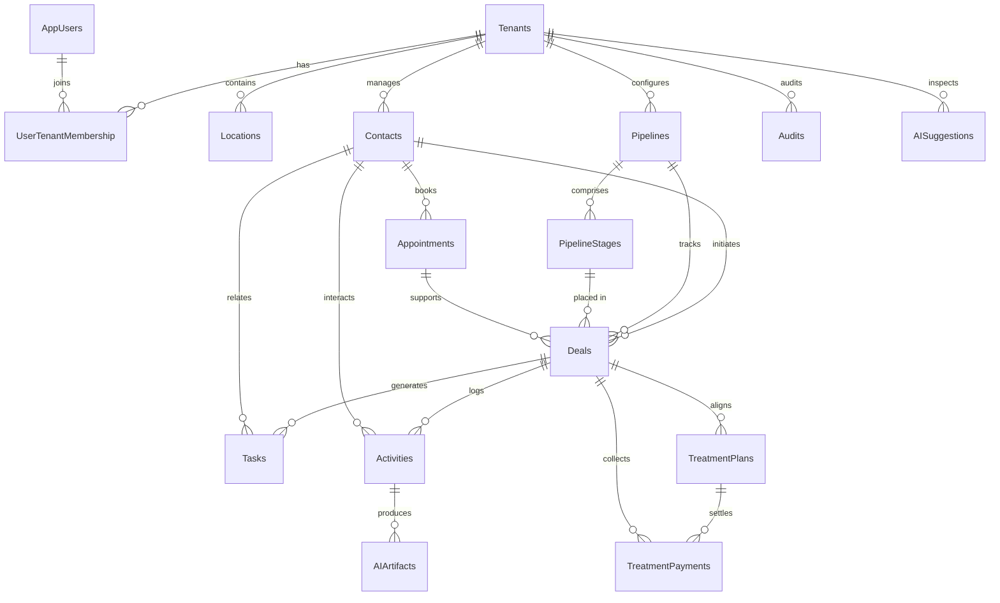

# Data Model & Tenancy

## Canonical Entities & Relationships
- **Tenant / Organization:** Root isolation boundary; owns locations, pipelines, contacts, automations, and AI artifacts. (`tenants` table)
- **Users & Memberships:** Supabase auth users mirror into `app_users`; `user_tenant_memberships` models many-to-many org access with role + status and drives RLS helper functions.
- **Locations:** Optional per-tenant branch records with unique indexes, helper functions, and RLS ensuring location-scoped visibility.
- **Contacts / Patients:** Tenants’ patient CRM records with demographic, consent, clinical, insurance, and preference fields plus soft delete support.
- **Deals & Pipelines:** Deals tie contacts to pipelines/stages, track treatment tags, owner, source, and timestamps; pipelines own ordered stages.
- **Tasks & Activities:** Activities capture multi-channel comms (call/email/WhatsApp/note), files, AI artifacts, and feed audit logging; tasks support auto-created follow-ups.
- **AI Artifacts & Suggestions:** `ai_artifacts`, `ai_chat_sessions`, `ai_suggestions`, and usage analytics persist transcripts, summaries, suggestions, and cost metrics.
- **Appointments & Treatment Plans:** `appointment_types` and `appointments` hold scheduling, provider, and linkage to deals; PMS integration tables manage treatment plans, payments, pipeline routing, and audit logs.
- **Financials:** `treatment_payments` connect PMS payments to treatment plans and deals; invoices reference appointments and contacts.
- **Audit / Event Logs:** `audits` and routing/audit log tables record lifecycle actions for compliance and tracing.

## ERD

## Multitenancy & Row-Level Security
- Membership-driven helper `public.get_current_user_tenant_id()` prioritises `active_tenant_id` then active memberships; applied uniformly across contacts, deals, pipelines, tasks, files, AI artifacts, and other tables with location-aware predicates.
- `user_tenant_memberships` enforces role/status, updated_at triggers, and strict RLS (users see own membership, owners/admins manage tenant rosters, service role bypass for migrations).
- Location policies call `user_has_location_access_rls` ensuring row visibility reflects membership + location assignments.

## Data Retention, Soft Deletes & Backups
- Soft-delete migration adds `deleted_at` columns across core tables, indexes non-deleted rows, and provides `is_not_deleted` helper + triggers to convert deletes into timestamped tombstones.
- Backup/restore subsystem introduces tenant-scoped `backup_policies`, `backup_records`, `restore_requests`, and `create_backup` function storing counts, checksums, retention windows, and audit entries.
- Privacy & DSR routines (`erase_contact_pii`, `export_contact_data`) anonymize PII/PHI, redact related notes/files, and create tombstones + audit events without losing business records.

## PII / PHI Handling & Masking
- Contacts include health-related columns (medical conditions, medications, anxiety level, treatment concerns) and consent columns (marketing/email/SMS) requiring careful handling.
- Privacy erasure function purges email/phone/address fields, clears custom data, redacts notes, erases call transcripts, marks files for deletion, and logs audit tombstones.
- Treatment routing tables track sensitive treatment tags with usage stats; AI tables store transcripts and summaries with tenant scoping.

## Evidence
- supabase/sql/01_initial_schema.sql:7-192
- supabase/migrations/20251025_001_user_tenant_memberships.sql:1-333
- supabase/migrations/20251027_001_strict_rls_auth_function.sql:30-199
- supabase/sql/45_treatment_routing.sql:25-196
- supabase/sql/17_ai_assistant_tables.sql:7-88
- supabase/sql/70_demo_seed_schema.sql:169-270
- supabase/sql/44_pms_integration.sql:26-210
- supabase/migrations/20251016_hardening_002_soft_delete.sql:15-125
- supabase/migrations/20251016_hardening_001_helpers.sql:93-118
- supabase/migrations/20251025_013_backup_recovery.sql:19-256
- supabase/migrations/20251016_hardening_012_privacy_dsr.sql:150-375

