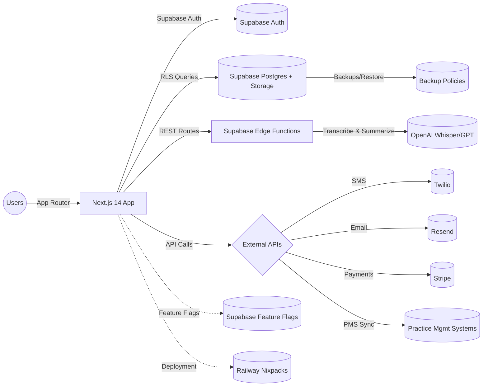

# Architecture & DevOps

## Architecture Overview

- Next.js front-end hosts UI, API route handlers, middleware, and client/server Supabase clients.
- Supabase provides Postgres (RLS), Auth, Storage, Edge Functions, and SQL-managed features (feature flags, automations, backups).
- Edge function handles heavy AI pipelines; other integrations use direct API clients from route handlers/lib services.

## Environments & Deployment

- **Local Dev:** `npm run dev` for Next.js, Supabase config (ports 54321/54322) for local DB/auth, CLI scripts for migrations (`supabase db lint/push`).
- **Testing:** Package scripts cover Jest unit/integration, Playwright E2E, accessibility, load (Artillery), Lighthouse, and type-checking.
- **Deployment:** Railway Nixpacks builder (`npm install --legacy-peer-deps && npm run build`) with restart-on-failure up to 10 retries; `deploy-to-railway.sh` seeds variables and triggers `railway up`.
- **Feature Flags:** env-based toggles plus Supabase feature flag table enable progressive rollout across environments.

## Observability & Operations

- **Logging:** Pino-based logger with PII redaction; automation listener/governance emit structured console logs; audit table persists entity-level actions.
- **Analytics:** PostHog integration stub indicates planned telemetry; analytics SDK + dashboards handle KPI/anomaly detection.
- **Cron & Jobs:** `/api/cron/scheduled-audits` endpoint secured via bearer secret triggers scheduled audits; `deal-sla-monitor` intended for cron invocation.
- **Rate Limiting:** Security lib implements in-memory per-IP limiter for request throttling; automation governance enforces execution quotas.

## Performance & Capacity

- **Database Indexing:** Core tables (contacts, deals, tasks, activities, audits, files) include tenant, status, and timestamp indexes; treatment routing tables add GIN indexes for keywords + trigram search.
- **Caching & Headers:** Next.js config adjusts cache headers for static assets vs API routes, enables compression, disables powered-by header.
- **Automation Scaling:** Rate limit records track hourly/daily counts, queue pause flags, email/SMS quotas; scheduled audits cap concurrency via batching.
- **Resource Limits:** Supabase storage capped at 50 MiB per file; JWT expiry enforced at 1 hour with refresh rotation.

## Evidence

- package.json:5-47,49-143
- supabase/config.toml:5-125
- railway.json:1-11
- deploy-to-railway.sh:20-144
- src/lib/feature-flags.ts:25-200
- src/lib/logger.ts:8-18
- src/lib/posthog.ts:1-38
- src/app/api/cron/scheduled-audits/route.ts:16-58
- src/lib/automations/deal-sla-monitor.ts:10-205
- src/lib/security.ts:10-58
- supabase/sql/01_initial_schema.sql:148-173
- supabase/sql/45_treatment_routing.sql:83-153
- next.config.js:5-88
