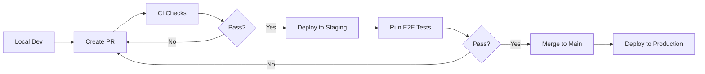

# Railway Deployment Guide

This guide provides step-by-step instructions for deploying the Dental CRM application to Railway with production-grade hardening.

## 🎯 Overview

This deployment includes:
- ✅ Health check endpoint (`/api/health`)
- ✅ Automatic PORT binding
- ✅ Database migration validation
- ✅ Pre-deploy smoke tests
- ✅ GitHub Actions CI gate
- ✅ Sentry error tracking
- ✅ Auto-restart on crash

---

## 📋 Prerequisites

Before deploying to Railway, ensure you have:

1. **Railway account** - Sign up at [railway.app](https://railway.app)
2. **GitHub repository** - AgenttoffeeOrg/dental-crm-private
3. **Supabase project** - For PostgreSQL database
4. **Environment variables** - Collected and ready (see below)

---

## 🚀 Initial Railway Setup

### Step 1: Create New Project

1. Go to [railway.app/new](https://railway.app/new)
2. Click **"Deploy from GitHub repo"**
3. Select **AgenttoffeeOrg/dental-crm-private**
4. Railway will automatically detect Next.js

### Step 2: Configure Service Settings

1. Go to your service → **Settings**
2. Configure the following:

#### Start Command
```bash
npm run start
```

**Note:** The app automatically binds to `$PORT` (no need to specify port)

#### Root Directory
```
/
```

#### Build Command (optional override)
```bash
npm run build
```

#### Install Command (optional override)
```bash
npm ci
```

---

## 🔐 Environment Variables

### Required Variables

In Railway → Service → **Variables**, add:

```env
# Node Environment
NODE_ENV=production

# Supabase (Database)
DATABASE_URL=postgresql://postgres:[password]@[host]:[port]/postgres
NEXT_PUBLIC_SUPABASE_URL=https://[your-project].supabase.co
NEXT_PUBLIC_SUPABASE_ANON_KEY=[your-anon-key]
SUPABASE_SERVICE_ROLE_KEY=[your-service-role-key]

# Authentication
JWT_SECRET=[generate-random-string-32-chars]
NEXTAUTH_URL=https://[your-railway-domain].railway.app
NEXTAUTH_SECRET=[generate-random-string]

# Sentry (Error Tracking)
NEXT_PUBLIC_SENTRY_DSN=https://9f500122e319dce965baba25e330cf07@o4510207888392192.ingest.de.sentry.io/4510207920701520
SENTRY_AUTH_TOKEN=[your-sentry-auth-token]
SENTRY_ORG=agenttoffeeorg
SENTRY_PROJECT=dental-crm
SENTRY_DEV=false

# App Configuration
BASE_URL=https://[your-railway-domain].railway.app

# Stripe (if using billing)
STRIPE_SECRET_KEY=[your-stripe-key]
NEXT_PUBLIC_STRIPE_PUBLISHABLE_KEY=[your-stripe-pub-key]

# Email (Resend)
RESEND_API_KEY=[your-resend-key]

# SMS (Twilio)
TWILIO_ACCOUNT_SID=[your-twilio-sid]
TWILIO_AUTH_TOKEN=[your-twilio-token]
TWILIO_PHONE_NUMBER=[your-twilio-number]

# OpenAI (if using AI features)
OPENAI_API_KEY=[your-openai-key]

# Google (for integrations)
GOOGLE_CLIENT_ID=[your-google-id]
GOOGLE_CLIENT_SECRET=[your-google-secret]
```

### Generate Secure Secrets

```bash
# JWT_SECRET (32 characters)
openssl rand -base64 32

# NEXTAUTH_SECRET (32 characters)
openssl rand -base64 32
```

---

## 🏥 Health Check Configuration

### Configure in Railway

1. Go to Service → **Settings** → **Health Check**
2. Enable health checks
3. Configure:

```
Health Check Path: /api/health
Port: (leave blank - uses $PORT automatically)
Success Status Code: 200
Timeout: 5 seconds
Interval: 30 seconds
Retries: 3
```

### How It Works

The `/api/health` endpoint returns:

```json
{
  "ok": true,
  "status": "healthy",
  "uptime": 3600,
  "timestamp": "2025-10-18T12:00:00.000Z",
  "environment": "production",
  "version": "1.0.0"
}
```

Railway will:
- ✅ Restart the service if health checks fail 3 times
- ✅ Wait up to 60 seconds for the app to start
- ✅ Route traffic only after health check passes

---

## 🗄️ Database Migrations

### Before First Deploy

1. Ensure all migrations are in `supabase/migrations/`
2. Migrations are automatically applied by Supabase
3. For manual migration:

```bash
# Validate migrations (locally)
npm run db:validate

# Push migrations to production (if needed)
npm run db:migrate
```

### Migration Strategy

- **Dev → Staging → Production** workflow recommended
- Always test migrations on staging first
- Use Supabase dashboard to verify schema changes
- Keep migration files in version control

---

## 🔄 Auto-Restart Configuration

### Enable Auto-Restart

1. Go to Service → **Settings** → **Deployment**
2. Enable **"Restart on crash"**
3. Set restart policy:
   - **Max Restarts:** 10
   - **Restart Window:** 10 minutes

### What Triggers Restart

- Process exits with non-zero code
- Health check fails 3 consecutive times
- Out of memory (OOM) error
- Unhandled promise rejections

---

## 🧪 Pre-Deploy Smoke Test

### How It Works

Before every deploy, GitHub Actions runs:

1. ✅ Build the application
2. ✅ Run unit tests
3. ✅ Run integration tests
4. ✅ Type checking
5. ✅ Linting
6. ✅ Database migration validation
7. ✅ **Smoke test** (starts server, hits `/api/health`)

If any check fails, **deployment is blocked**.

### Run Smoke Test Locally

```bash
# Start server
PORT=3000 npm run start &

# Run smoke test
npm run smoke

# Stop server
kill %1
```

---

## 📊 Monitoring & Alerts

### Sentry Integration

Sentry is automatically configured for:
- **Client-side errors** (browser)
- **Server-side errors** (API routes)
- **Edge runtime errors** (middleware)
- **Performance monitoring**
- **Session replay**

**Dashboard:** https://agenttoffeeorg.sentry.io/

### Checkly Uptime Monitoring

Synthetic monitors check your app every 5 minutes:
- Homepage loads
- Login flow works
- API responds

**Dashboard:** https://app.checklyhq.com/

### Railway Logs

View real-time logs:
1. Go to Service → **Deployments**
2. Click on latest deployment
3. View **Logs** tab

Filter logs by:
- `error` - Show only errors
- `health` - Show health check logs
- `migration` - Show database migrations

---

## 🚨 Troubleshooting

### Issue: Address Already in Use (EADDRINUSE)

**Symptoms:**
```
Error: listen EADDRINUSE: address already in use :::3000
```

**Cause:** PORT is hardcoded or not using `$PORT`

**Fix:**
- Verify `package.json` has: `"start": "next start -p ${PORT:-3000}"`
- Ensure Railway passes `$PORT` environment variable (automatic)

---

### Issue: Cannot Find Module

**Symptoms:**
```
Error: Cannot find module './dist/server.js'
```

**Cause:** Build artifacts missing or incorrect working directory

**Fix:**
1. Verify `npm run build` completes successfully
2. Check `.next/` directory exists after build
3. Ensure Railway **Root Directory** is `/`
4. Check `.gitignore` doesn't exclude `.next/` (it should be built on Railway)

---

### Issue: Database Connection Failed

**Symptoms:**
```
Error: dial tcp: i/o timeout
Error: password authentication failed
```

**Cause:** Invalid `DATABASE_URL` or network issue

**Fix:**
1. Verify `DATABASE_URL` in Railway → Variables
2. Test connection locally:
   ```bash
   psql "$DATABASE_URL"
   ```
3. Check Supabase IP allowlist (if restricted)
4. Ensure database is running (check Supabase dashboard)

---

### Issue: Health Check Failing (502 Bad Gateway)

**Symptoms:**
- Railway shows "Unhealthy"
- 502 errors on frontend

**Cause:** App not starting or health endpoint not responding

**Fix:**
1. Check Railway logs for errors:
   ```
   Service → Deployments → [Latest] → Logs
   ```
2. Verify `/api/health` returns 200:
   ```bash
   curl https://[your-app].railway.app/api/health
   ```
3. Increase health check timeout to 10 seconds
4. Check memory usage (might be OOM)

---

### Issue: Out of Memory (OOM)

**Symptoms:**
```
JavaScript heap out of memory
Process exited with code 137
```

**Cause:** Not enough memory allocated

**Fix:**
1. Upgrade Railway plan (Hobby → Pro)
2. Optimize build:
   ```bash
   NODE_OPTIONS=--max-old-space-size=4096 npm run build
   ```
3. Add to Railway variables:
   ```
   NODE_OPTIONS=--max-old-space-size=2048
   ```

---

## 🎯 Deployment Workflow

### Recommended Flow



### Step-by-Step

1. **Local Development**
   ```bash
   npm run dev
   ```

2. **Create Feature Branch**
   ```bash
   git checkout -b feature/my-feature
   ```

3. **Commit Changes**
   ```bash
   git add .
   git commit -m "feat: add new feature"
   ```

4. **Push & Create PR**
   ```bash
   git push origin feature/my-feature
   ```

5. **Wait for CI Checks**
   - Pre-deploy workflow runs
   - Playwright E2E tests run
   - Percy visual tests run
   - Semgrep SAST scan runs

6. **Review & Merge**
   - All checks ✅ green
   - Code review approved
   - Merge to `main`

7. **Automatic Deployment**
   - Railway detects push to `main`
   - Builds and deploys automatically
   - Health check validates deployment
   - Checkly monitors uptime

---

## 🎛️ Advanced Configuration

### Custom Start Command

If you need a custom start script:

**Create `scripts/start-production.sh`:**
```bash
#!/bin/bash
set -e

echo "🚀 Starting production server..."

# Run migrations (if needed)
# npm run db:migrate

# Start Next.js
exec npm run start
```

**Update Railway Start Command:**
```bash
bash scripts/start-production.sh
```

### Graceful Shutdown

Railway sends `SIGTERM` before killing the process. Handle it:

**Create `src/lib/graceful-shutdown.ts`:**
```typescript
export function setupGracefulShutdown() {
  process.on('SIGTERM', async () => {
    console.log('SIGTERM received, starting graceful shutdown...')
    
    // Close database connections
    // await db.destroy()
    
    // Close other resources
    
    console.log('Graceful shutdown complete')
    process.exit(0)
  })
}
```

**Call in `instrumentation.ts`:**
```typescript
import { setupGracefulShutdown } from '@/lib/graceful-shutdown'

setupGracefulShutdown()
```

---

## 📊 Performance Optimization

### Build Optimization

Add to `next.config.ts`:

```typescript
export default {
  // ... existing config
  
  // Production optimizations
  swcMinify: true, // Fast minification
  compiler: {
    removeConsole: process.env.NODE_ENV === 'production', // Remove console.log
  },
  
  // Output standalone for Railway
  output: 'standalone',
}
```

### Memory Limits

Set in Railway → **Settings** → **Resources**:

- **Development:** 2 GB RAM
- **Staging:** 4 GB RAM
- **Production:** 8 GB RAM

### Caching

Enable Redis for caching (optional):

1. Add Redis plugin in Railway
2. Use `REDIS_URL` environment variable
3. Cache expensive queries:

```typescript
import Redis from 'ioredis'

const redis = new Redis(process.env.REDIS_URL!)

export async function getCached<T>(
  key: string,
  fallback: () => Promise<T>,
  ttl = 3600
): Promise<T> {
  const cached = await redis.get(key)
  if (cached) return JSON.parse(cached)
  
  const fresh = await fallback()
  await redis.setex(key, ttl, JSON.stringify(fresh))
  
  return fresh
}
```

---

## ✅ Pre-Deploy Checklist

Before deploying to production:

- [ ] All environment variables set in Railway
- [ ] Health check endpoint returns 200
- [ ] Database migrations tested on staging
- [ ] Sentry configured and receiving events
- [ ] Checkly monitors created and passing
- [ ] GitHub Actions pre-deploy workflow passing
- [ ] E2E tests passing
- [ ] Visual regression tests passing
- [ ] Load testing completed (artillery)
- [ ] Error tracking dashboard configured
- [ ] Monitoring alerts configured
- [ ] Backup strategy in place (Supabase Point-in-Time Recovery)
- [ ] SSL certificate valid (automatic via Railway)
- [ ] Custom domain configured (if applicable)
- [ ] DNS records updated (if applicable)

---

## 🆘 Support & Resources

### Documentation

- **Railway Docs:** https://docs.railway.app
- **Next.js Deployment:** https://nextjs.org/docs/deployment
- **Supabase:** https://supabase.com/docs

### Dashboards

- **Railway:** https://railway.app/project/[your-project]
- **Sentry:** https://agenttoffeeorg.sentry.io
- **Checkly:** https://app.checklyhq.com
- **GitHub Actions:** https://github.com/AgenttoffeeOrg/dental-crm-private/actions

### Emergency Contacts

- **Railway Status:** https://status.railway.app
- **Supabase Status:** https://status.supabase.com

---

## 🎉 You're Ready!

Your Dental CRM is now production-ready with:

✅ Hardened deployment configuration  
✅ Health checks and auto-restart  
✅ Database migration automation  
✅ Pre-deploy smoke tests  
✅ Comprehensive monitoring  
✅ Error tracking with Sentry  
✅ Uptime monitoring with Checkly  

**Deploy with confidence!** 🚀

